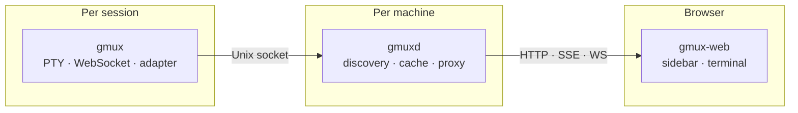
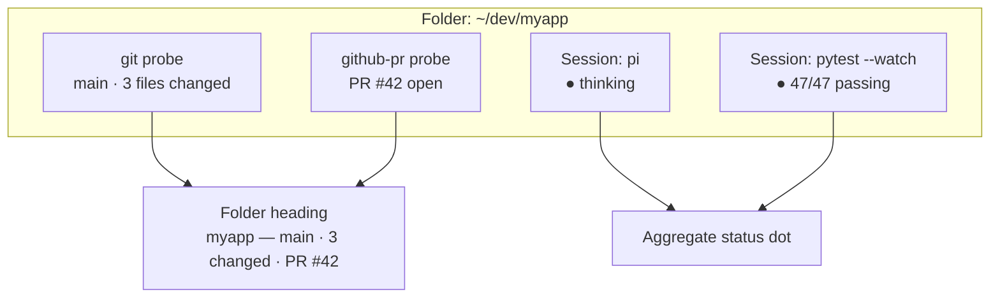
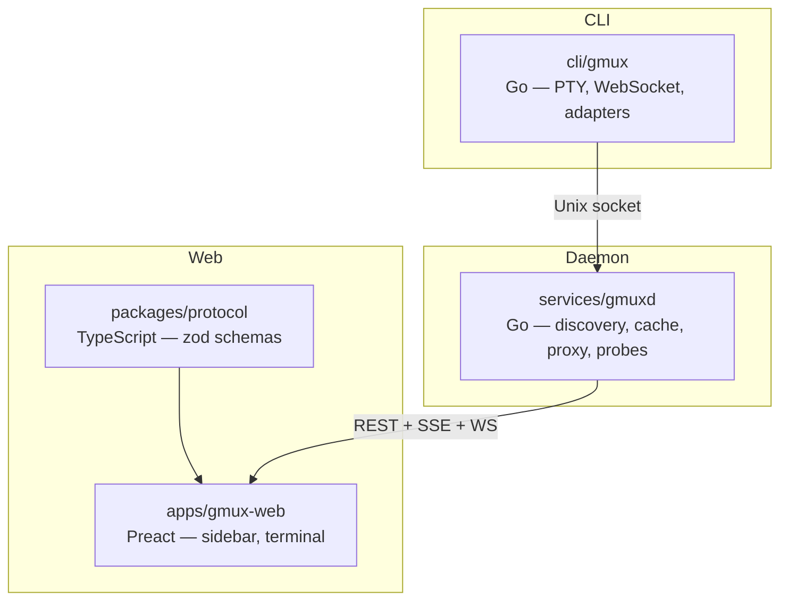

# gmux

**Keep tabs on every AI agent, test runner, and long-running process across your machines. Work from your desktop, steer from your phone.**

Launch any command as a managed session. gmux gives you a live, interactive terminal for each one — grouped by project, with real-time status updates pushed to your browser. When an agent needs input, you'll know. When tests fail, you'll see it. Switch to your phone and the same view is there, ready for you to course-correct.

No Electron, no desktop app. Just a browser and two small binaries.

## Install

macOS:

```bash
brew install gmuxapp/tap/gmux
```

Linux:

```bash
curl -sSfL https://gmux.app/install.sh | sh
```

Windows (initial native support): download the latest Windows release archive from [GitHub Releases](https://github.com/gmuxapp/gmux/releases), extract `gmux.exe` and `gmuxd.exe`, and keep both binaries in the same directory on `PATH`. WSL is optional, not required.

## Quick start

```bash
gmux pi                    # launch a coding agent
gmux pytest --watch        # launch a test watcher
gmux make build            # or literally any command
gmux                       # open the UI
```

Open `localhost:8790` — all three sessions are there, grouped by project, with live status indicators. Click one to attach a full terminal. The same xterm.js that powers the VS Code terminal, running in your browser.

The daemon (`gmuxd`) starts automatically on first use. There's nothing else to set up. For daemon commands, run `gmuxd -h`.

Windows support is initial. The primary tested path is Windows Terminal with PowerShell 7 or Windows PowerShell. Optional launchers such as Git Bash, WSL, Codex, Copilot, and Gemini only appear when their commands are installed, and their behavior still depends on the launched shell/tool.

## How it works



**`gmux`** wraps any command in a managed session. It allocates a PTY, serves a WebSocket for terminal access, and runs an **adapter** that understands what the child process is doing. A pi session knows when the agent is thinking vs waiting for input. A test runner knows when tests are failing. A generic command gets alive/dead/activity tracking out of the box. With no arguments, it opens the UI in your browser.

**`gmuxd`** runs once per machine (auto-started by `gmux`). It discovers sessions via their Unix sockets, caches their state, proxies WebSocket connections, and pushes real-time updates to the browser via SSE. It's stateless — restart it anytime, it rebuilds from what's running.

**`gmux-web`** is the browser UI. The sidebar groups sessions by working directory, with status dots that pulse when something needs attention. The terminal is xterm.js — the same battle-tested terminal emulator that powers VS Code's integrated terminal — with synchronized output for flicker-free session switching and 128KB of scrollback that replays instantly on reconnect.

## What you see

```
┌─────────────────────────────────────┐
│ gmux                          alpha │
│                                     │
│ ▼ myapp                        ● 2  │
│   main · 3 changed · PR #42        │
│                                     │
│   ● fix auth bug               now  │
│     thinking · pi                   │
│                                     │
│   ● test watcher             2m ago │
│     47/47 passing · pytest          │
│                                     │
│ ▼ gmux                         ● 1  │
│   feature/probes · clean            │
│                                     │
│   ● bootstrap                  5m   │
│     waiting for input · pi          │
│                                     │
│ ▸ docs                        ○ 1   │
│   main · completed                  │
└─────────────────────────────────────┘
```

Sessions are grouped into **folders** by working directory. Each folder heading is enriched by **probes** — lightweight observers that report git branch, dirty state, open PRs, or anything you script. The folder's status dot reflects the most urgent session inside it.

## Features

### Sessions
- **Launch anything** — `gmux <command>` wraps any process in a managed session
- **Full terminal** — xterm.js with WebSocket transport, the same terminal emulator as VS Code
- **128KB scrollback** — replays instantly on reconnect, no lost context
- **Flicker-free switching** — DEC 2026 synchronized output renders session swaps in a single frame
- **Session lifecycle** — live status, exit codes, kill from the UI
- **Reconnecting** — tab away, come back, the terminal is right where you left it

### Adapters — session-level intelligence
Adapters teach gmux how to work with specific tools. They're compiled into the binary and selected automatically by command name.

- **Auto-detection** — `gmux pi` recognizes pi and activates the pi adapter. No flags needed.
- **Rich status** — adapters report what the child is doing: thinking, waiting for input, tests passing, build failing
- **Child awareness** — any tool can self-report status via `PUT /status` on `$GMUX_SOCKET`, no adapter required
- **Graceful fallback** — unknown commands get the shell adapter

### Probes — directory-level intelligence
Probes observe the working directory and enrich folder headings with project context.



- **Git** — branch name, dirty file count
- **GitHub PR** — PR number, status, clickable link
- **Script probes** — drop a bash script in `~/.config/gmux/probes/`, it runs against each matching directory and returns JSON. Five lines gets you custom folder intelligence.

### UI
- **Triage-first** — sessions sorted by what needs attention, not alphabetically
- **Automatic grouping** — sessions sharing a working directory group into folders, no manual organization
- **Header bar** — contextual metadata and actions for the selected session
- **Mobile responsive** — same URL on your phone, tap a session, type a steering message, done
- **URL scoping** — `?project=myapp` filters to one project. Bookmark it for a per-project browser tab.
- **Nord dark theme** — designed for long sessions, Inter + JetBrains Mono typography

### Architecture
- **Runner-authoritative** — gmux is the source of truth, gmuxd is a rebuildable cache
- **No external dependencies** — no tmux, no screen, no abduco. Two Go binaries and a web app.
- **Web-first** — works on desktop, tablet, phone. Same URL everywhere.
- **Zero config** — run `gmux <command>`, open a browser

## Extensibility

| Layer | Mechanism | Runs in | What it does |
|-------|-----------|---------|--------------|
| Session | **Adapters** (Go) | gmux | Recognize commands, monitor output, report rich status |
| Directory | **Probes** (Go or bash) | gmuxd | Observe directories, report git/PR/CI metadata |
| Child process | **HTTP API** on `$GMUX_SOCKET` | child | Self-report status without any adapter |
| User scripts | **Script probes** in `~/.config/gmux/probes/` | gmuxd | Custom directory intelligence, no compilation |

## Development

See [CONTRIBUTING.md](CONTRIBUTING.md) for prerequisites and setup.

```bash
pnpm install      # JS dependencies
./dev              # start all services with watch/HMR
```

### Monorepo layout



| Path | Language | Purpose |
|------|----------|---------|
| `cli/gmux` | Go | Session launcher — PTY, WebSocket, adapters |
| `services/gmuxd` | Go | Machine daemon — discovery, cache, WS proxy, embedded web UI |
| `apps/gmux-web` | TypeScript/Preact | Browser UI — sidebar, terminal, header bar |
| `packages/protocol` | TypeScript | Shared schemas, zod-validated |
| `apps/website` | Astro/Starlight | Documentation site |

## Docs

Documentation lives in the [website](apps/website/src/content/docs/):

- [Architecture](apps/website/src/content/docs/architecture.md) — runtime structure (gmux, gmuxd, web UI)
- [Session Schema](apps/website/src/content/docs/develop/session-schema.md) — metadata model
- [Adapter Architecture](apps/website/src/content/docs/develop/adapter-architecture.md) — how adapters work
- [Security](apps/website/src/content/docs/security.md) — threat model and safeguards
- [Remote Access](apps/website/src/content/docs/remote-access.md) — tailscale setup

## License

MIT
